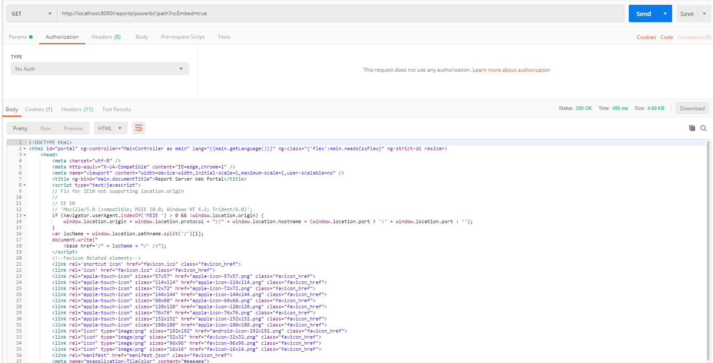

# Reports proxy
此程序为嵌入PowerBI报表的后端demo，查看[前端demo](https://github.com/TTcheng/PowerBiReportServerAPI-Demo)，主要负责代理前台请求并添加验证信息，可选择使用httpclient或okhttp与报表服务器通信,认证方式可选择ntlm或basic。

Note：1.使用basic认证前需要先配置自定义安全性。参考[PowerBiCustomSecuritySample](https://github.com/TTcheng/PowerBiCustomSecuritySample)
     		2.基于httpClient的代理已经测试，无论是ntlm还是basic都可以实现。okHttp还存在问题，任处于开发中。

配置认证方式和请求客户端
```properties
# 认证方式，ntlm/basic
reports.authType=ntlm
# 代理请求客户端，httpClient/okhttp
reports.proxyClient=httpClient
```


如下图所示，可以不提供认证信息获取要嵌入的页面

